# arduino-sensors

Scripts to use for various sensors with Arduino

Wiring diagram - Potentiometer (rotary potentiometer):

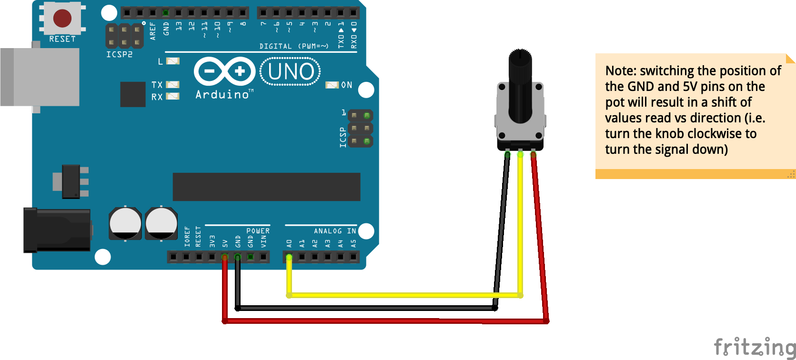

Wiring diagram - Slide potentiometer (linear potentiometer):

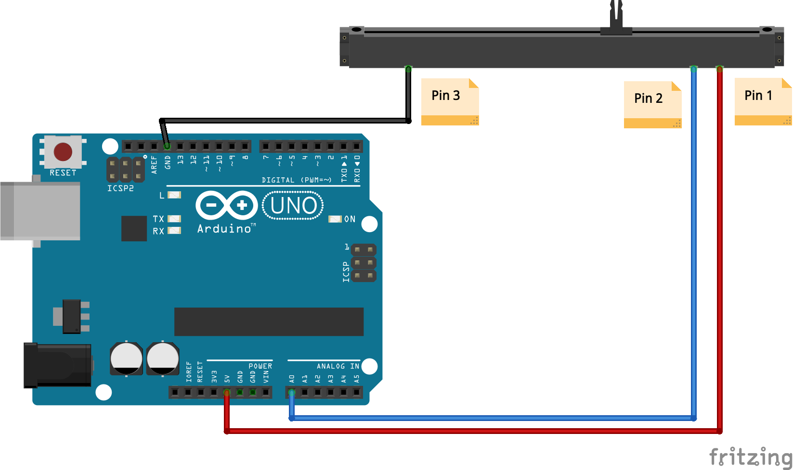

Wiring diagram - Joystick:

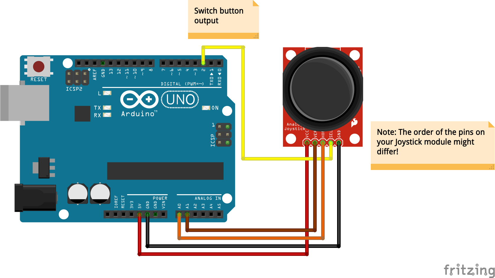

Wiring diagram - Rotary Encoder:

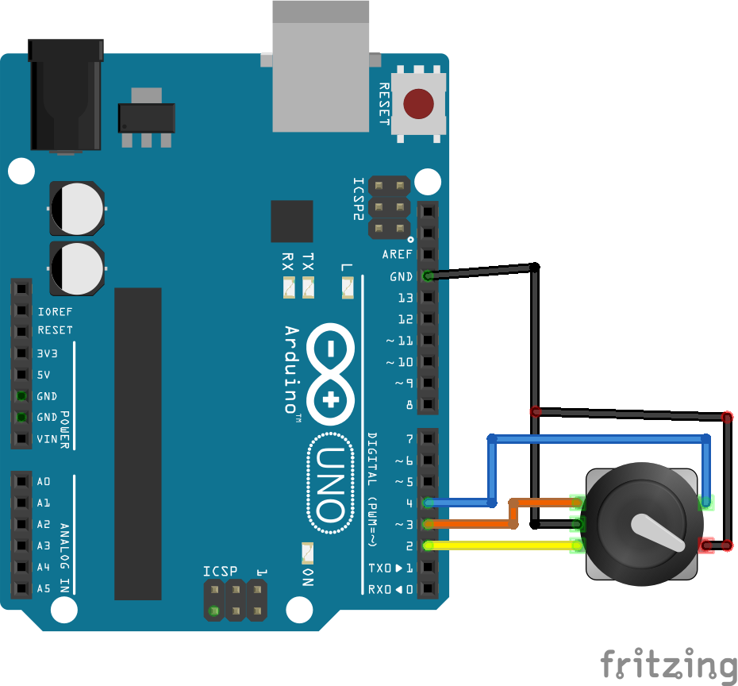

Wiring diagram - Limit Switch (Micro Switch):

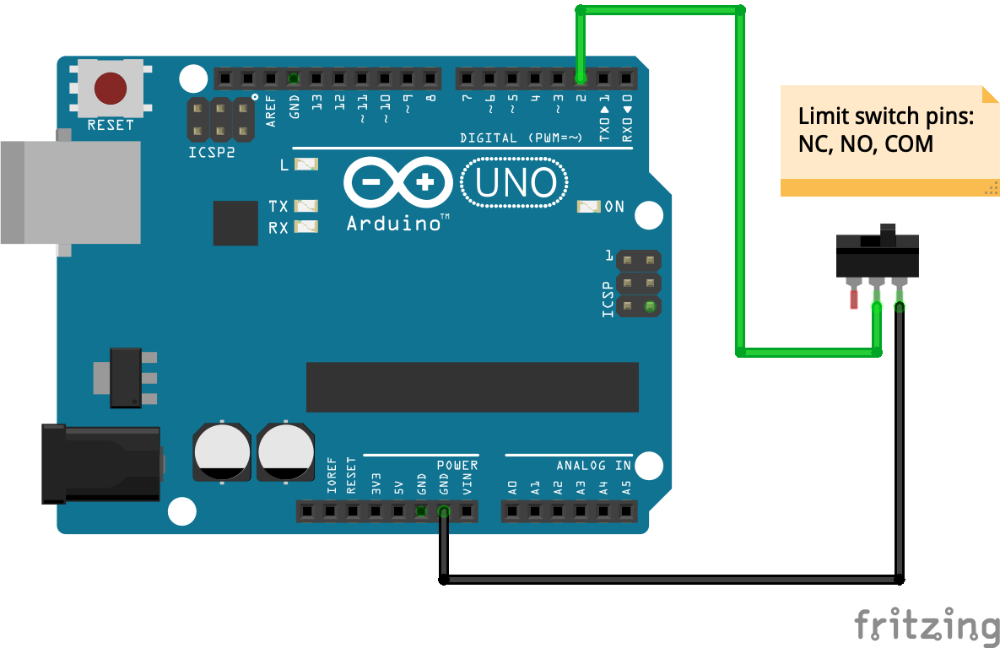

Wiring diagram - GY-521 Accelerometer + Gyroscope (MPU-6050):

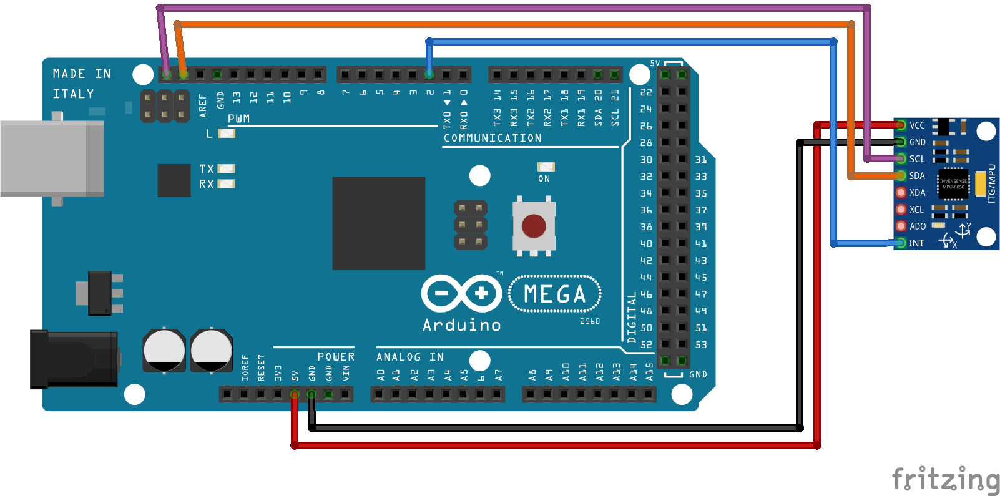

Wiring diagram - GY-91 10-DOF Accelerometer + Gyroscope + Magnetometer + Barometer (MPU-9250 + BMP280):

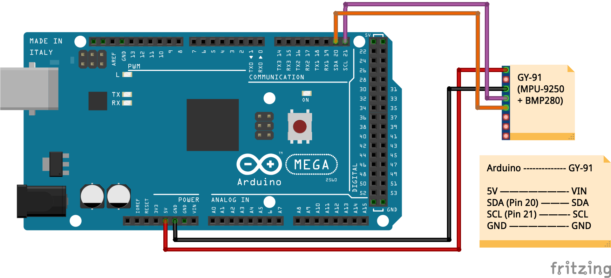

Wiring diagram - PIR motion detection sensor:

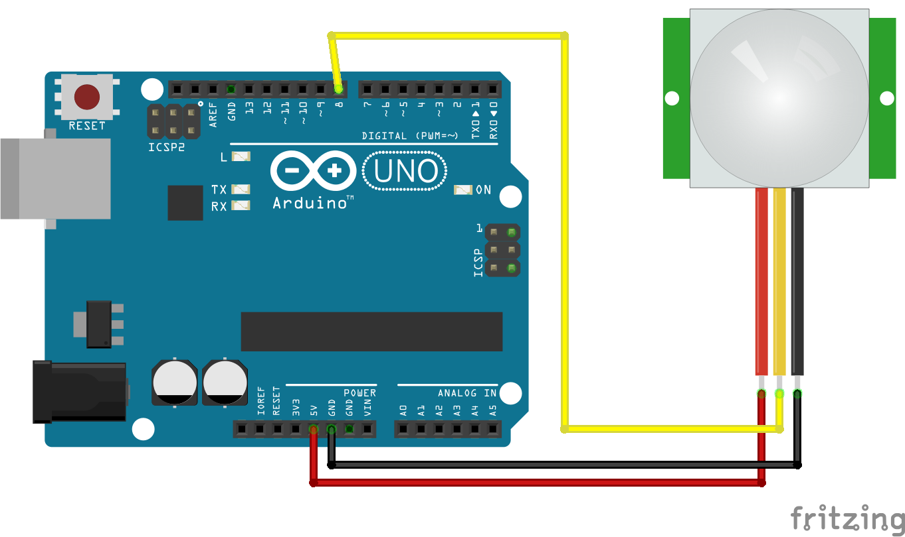

Wiring diagram - Ultrasonic distance sensor:

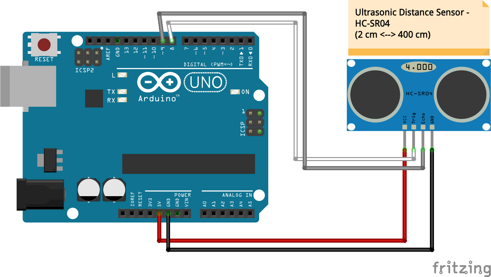

Wiring diagram - Photocell (light sensor):

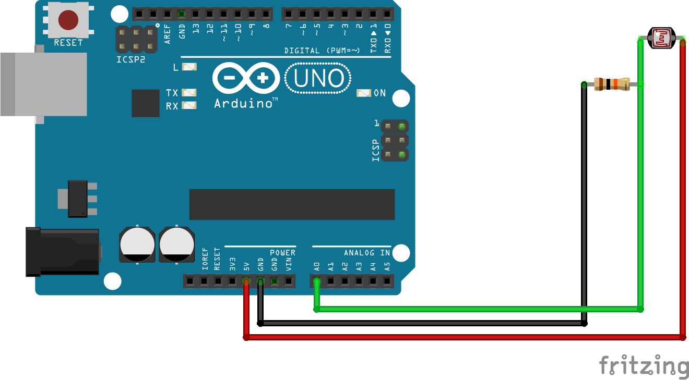

Wiring diagram - DS1302 RTC (Real Time Clock):

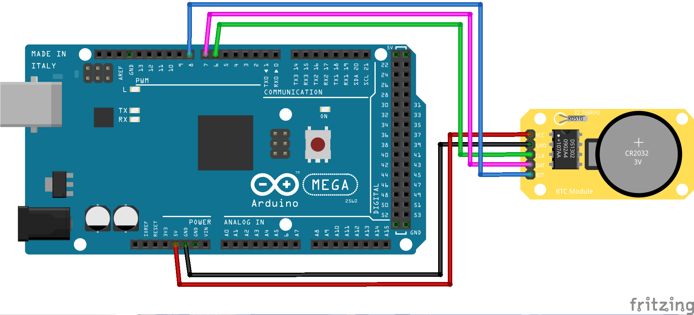

Wiring diagram - microSD card module:

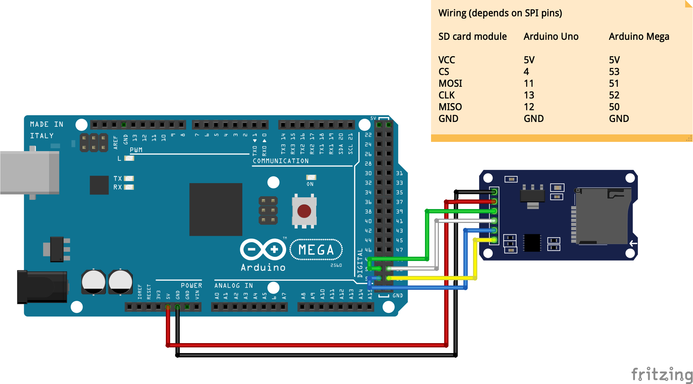

Wiring diagram - PulseSensor (PPG sensor):

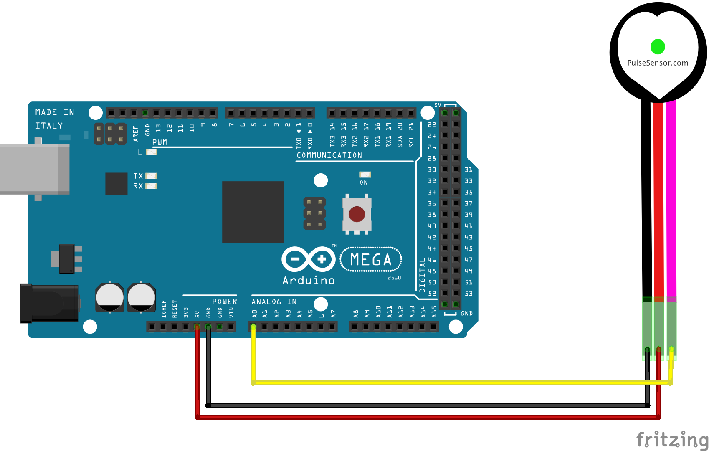

Wiring diagram - MQ-2 / MQ-3 (gas sensors):

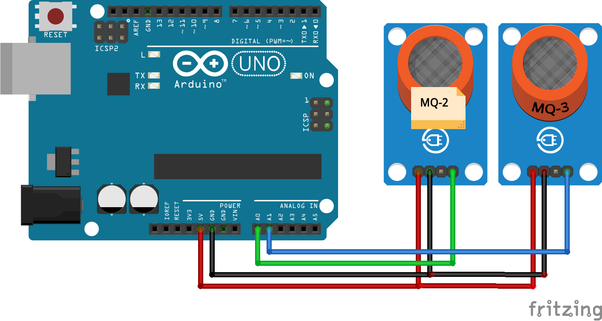

Wiring diagram - Touch sensor / Capacitative touch module:

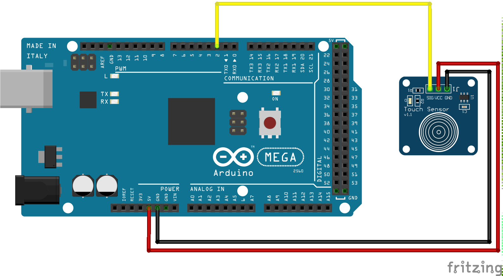

Wiring diagram - DS18B20 temperature sensor:

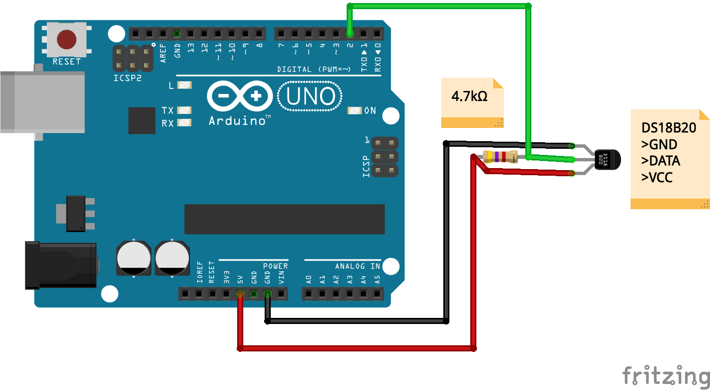

Wiring diagram - VL6180 time of flight (ToF) range finder sensor (incl. light sensor):

Wiring diagram - CCS811 air quality sensor:

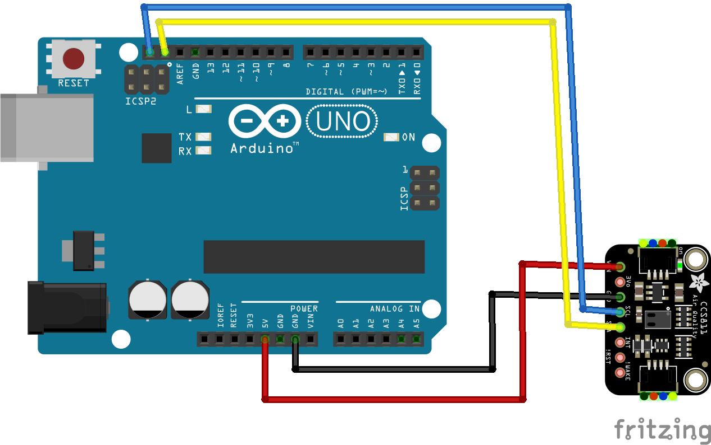
