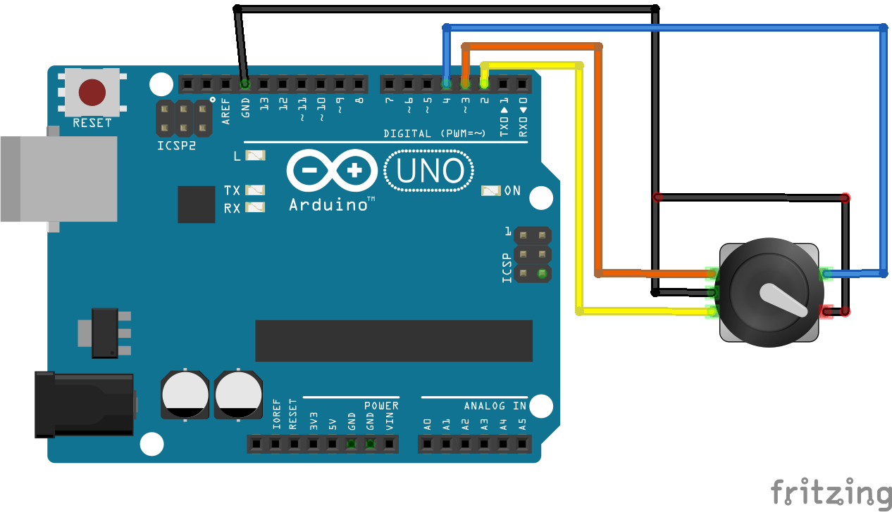
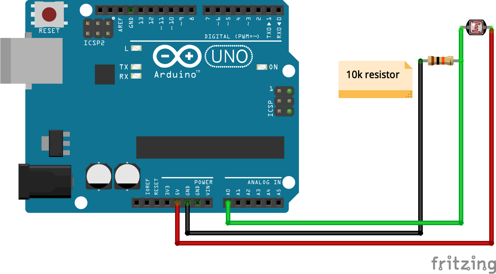

# arduino-sensors

Scripts to use for various sensors with Arduino

Wiring diagram - Joystick:

Wiring diagram - Rotary Encoder:

Wiring diagram - Limit Switch (Micro Switch):

Wiring diagram - GY-521 Accelerometer + Gyroscope (MPU-6050):

Wiring diagram - GY-91 10-DOF Accelerometer + Gyroscope + Magnetometer + Barometer (MPU-9250 + BMP280):

Wiring diagram - PIR motion detection sensor:

Wiring diagram - Ultrasonic distance sensor:

Wiring diagram - Photocell (light sensor):

